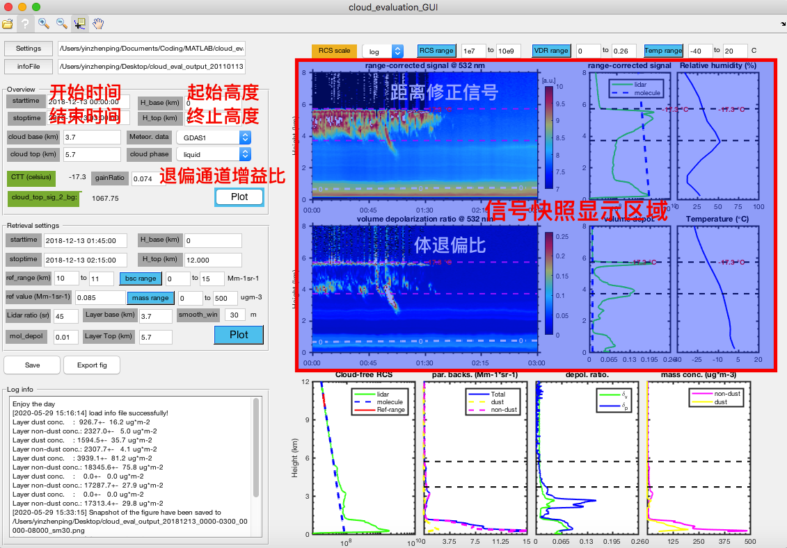
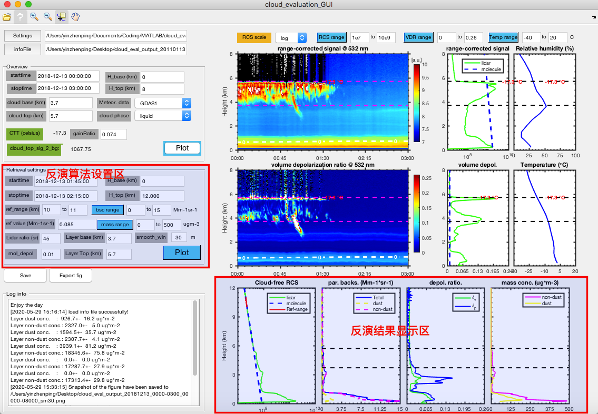

# 偏振雷达数据分析小程序

## 主要功能

> 当前版本 0.0.1

小程序功能非常直观，提供一些常用的气溶胶反演算法和数据可视化功能：

- 距离修正信号和体退偏比伪彩图
- 读取常规气象要素并可视化（[GDAS1][1]，[Radiosonde][2]和[ERA-5][3]）
- Fernald算法和沙尘分离算法
- 支持保存反演结果和反演配置信息

<p align='center'>

<br>
<b>偏振雷达分析小程序使用截图</b>

## 下载及使用

> 小程序基于**MATLAB 2016b**开发，其它版本的**MATLAB**未进行测试，如果有使用问题请参考[故障反馈](#故障反馈)

### 下载

<p align='center'>

<br>
<b>如何下载代码仓库</b>

:point_right:如果你懂Git的话，可以使用下面命令下载该代码仓库

```bash
git clone https://github.com/ZPYin/cloud_evaluation_GUI.git
cd cloud_evaluation_GUI
```

### 使用

**场景1:探测结果快照**

小程序会根据`settings`文件中的路径和配置的开始结束时间搜索数据，并在**信号快照显示区域**进行显示。其中坐标范围可以根据相关的设定选项进行选择。

> 工具栏中的`DataTip`工具可以查看图形中单个点的数值。

<p align='center'>

<br>
<b>选择结果区间并快速可视化</b>

**场景2:反演设置**

在通过快照确定了无云的范围后，可以进行气溶胶垂直剖面的反演。在小程序中反演设置区可以对反演过程的雷达比、分子退偏比等进行设置，点击`Plot`可以在反演结果显示区中显示垂直剖面。

<p align='center'>

<br>
<b>反演结果</b>

**场景3:保存结果**

点击`save`按钮，整个快照和反演结果会保存到[mat][4]格式的info文件中。这个文件可以用于后续的统计分析，并且可以通过`infoFile`按钮直接导入到小程序中。除此之外，小程序的快照可以通过`Export fig`按钮导出。

## 故障反馈

如果你有任何问题，请到[issue][5]板块中提问。在提问中请提供你的软件版本、**MATLAB**版本，并描述清楚问题的产生步骤和问提症状。我会定期查看并回复。

## 开发人员

|姓名|邮箱|
|:-:|:--:|
|殷振平|zp.yin@whu.edu.cn|

[1]: https://www.ready.noaa.gov/gdas1.php
[2]: http://weather.uwyo.edu/upperair/bufrraob.shtml
[3]: https://www.ecmwf.int/en/forecasts/datasets/reanalysis-datasets/era5
[4]:https://www.reviversoft.com/file-extensions/mat
[5]: https://github.com/ZPYin/cloud_evaluation_GUI/issues