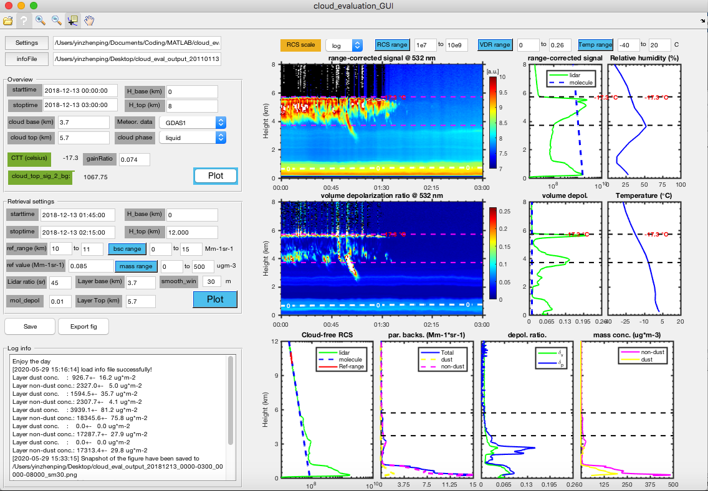
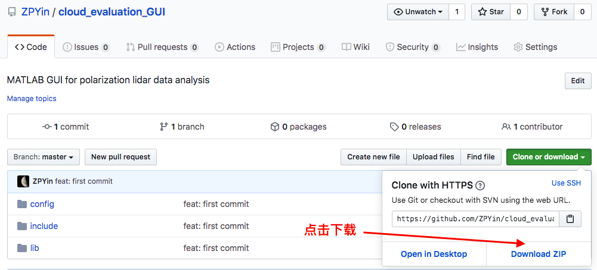

# 偏振雷达数据分析小程序

## 主要功能

小程序功能非常直观，提供一些常用的气溶胶反演算法和数据可视化功能：

- 距离修正信号和体退偏比伪彩图
- 读取常规气象要素并可视化（[GDAS1][1]，[Radiosonde][2]和[ERA-5][3]）
- Fernald算法和沙尘分离算法
- 支持保存反演结果和反演配置信息

<p align='center'>

<br>
<b>偏振雷达分析小程序使用截图</b>

## 下载及使用

> 小程序基于**MATLAB 2016b**开发，其它版本的**MATLAB**未进行测试，如果有使用问题请参考[故障反馈](#故障反馈)

### 下载

<p align='center'>

<br>
<b>如何下载代码仓库</b>

:point_right:如果你懂Git的话，可以使用下面命令下载该代码仓库

```bash
git clone https://github.com/ZPYin/cloud_evaluation_GUI.git
cd cloud_evaluation_GUI
```

### 使用方法

> 使用指南请参考[wiki][6]

## 故障反馈

如果你有任何问题，请到[issue][5]板块中提问。在提问中请提供你的软件版本、**MATLAB**版本，并描述清楚问题的产生步骤和问提症状。我会定期查看并回复。

## 开发人员

|姓名|邮箱|
|:-:|:--:|
|殷振平|zp.yin@whu.edu.cn|

[1]: https://www.ready.noaa.gov/gdas1.php
[2]: http://weather.uwyo.edu/upperair/bufrraob.shtml
[3]: https://www.ecmwf.int/en/forecasts/datasets/reanalysis-datasets/era5
[4]: https://www.reviversoft.com/file-extensions/mat
[5]: https://github.com/ZPYin/cloud_evaluation_GUI/issues
[6]: https://github.com/ZPYin/cloud_evaluation_GUI/wiki/%E5%89%8D%E8%A8%80
