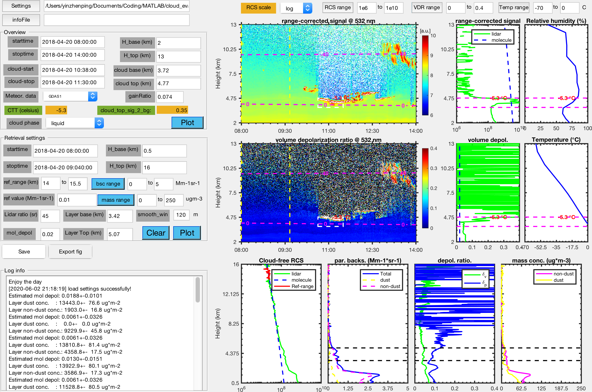

# 数据格式说明

## 输入数据

数据数据分为激光雷达数据和气象要素数据两种。

### 激光雷达数据

> 激光雷达数据目前仅支持偏振雷达数据。

雷达数据采用统一的由Licel拼接后的数据，因为版本原因，目前实验室内部使用有经[IDL程序][1]输出的30m分辨率的拼接数据和经过[MATLAB程序][2]输出的7.5/3.75m分辨率的数据。这两种数据可以通过[settings.yml](../config/settings.yml)文件中的`data_version`进行设置。数据存按一级目录进行存放，即数据文件全部位于主目录下。

``` bash
PLidar532nm
├── 20180416.h5
├── 20180417.h5
├── 20180418.h5
├── 20180419.h5
├── 20180420.h5
├── 20180427.h5
└── 20180428.h5
```

### 气象要素数据

气象要素数据均为提取后的标准数据格式，相关的提取代码参考下表

|种类|代码名称|
|:--|:------:|
|GDAS1|[ARLreader][3]|
|Radiosonde|[data_downloader][4]|

数据下载后，只需要在[settings.yml](../config/settings.yml)中配置好相关的目录，就可以在小程序中载入气象要素数据。

## 输出数据

输出数据分为数据和图片两种，数据目前仅支持[mat][5]文件。在数据文件中，包含有所有显示区的数据（overviewInfo和retrievalInfo）和左侧控制面板的控件状态（widgetInfo），方便后续进行数据分析。

数据文件的命名规则如下所示：

    **cloud_eval_output_{cloud_starttime:yyyymmdd_HHMM}-{cloud_stoptime:yyyymmdd_HHMM}-{cloud_base}-{cloud_tmp}_sm{smooth_window}.mat**

而图片为当前整个小程序的截图。

<p align='center'>

<br>
<b>程序运行截图</b>

这两个结果都保存到同一个目录中，且保存目录由[settings.yml](../config/settings.yml)进行配置。

## 联系方式

|职位|姓名|邮箱|
|:--:|:--:|:--:|
|主要开发|殷振平|zp.yin@whu.edu.cn|


[1]: https://gitee.com/mualidar/MUA_IDL_Routines/tree/master/LicelProcessTest
[2]: https://github.com/ZPYin/Universal_Data_Converter
[3]: https://github.com/ZPYin/ARLreader
[4]: https://gitee.com/WHU-Lidar/Data_Downloader.git
[5]: https://www.reviversoft.com/file-extensions/mat